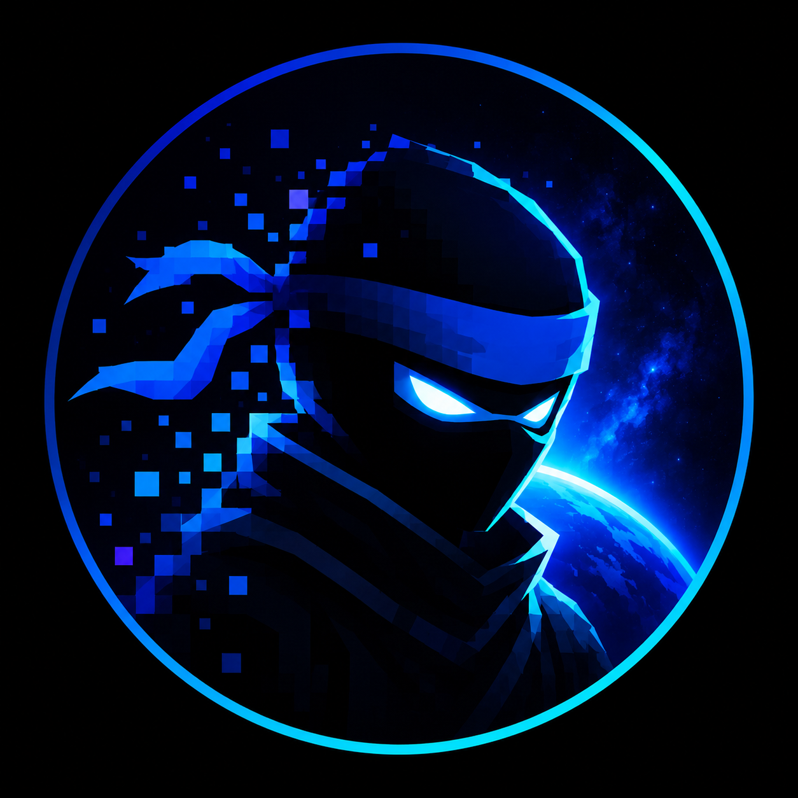

# Ninja Hub

<p align="center">
  
</p>

<h3 align="center">Une communauté moderne, active et ouverte à tous 🚀</h3>

---

## 📌 Présentation

Bienvenue sur **NinjaHub** !

Notre serveur Discord est une communauté où les membres peuvent discuter, partager leurs passions, créer des projets et participer à des événements.

Notre objectif est de créer un espace **convivial, sécurisé et dynamique** pour tous.

---

## ✨ Fonctionnalités

- 💬 Salons de discussion organisés
- 🎮 Espaces gaming
- 🎨 Partage de créations
- 🤝 Rencontres et collaborations
- 🎉 Événements communautaires
- 🛡️ Modération active
- 🤖 Bots et outils personnalisés

---

## 🏠 Catégories du serveur

```
📢 Informations
💬 Discussions
🎮 Gaming
🎨 Créations
🎵 Musique
🤖 Commandes bots
🔒 Staff
```

---

## 👥 La communauté

Notre communauté rassemble des membres passionnés qui aiment :
- échanger
- apprendre
- créer
- partager leurs projets

Chaque membre contribue à faire évoluer le serveur.

---

## 📜 Règles principales

✅ Respect entre membres  
❌ Pas de spam  
❌ Pas de contenu interdit  
❌ Pas de harcèlement  
✅ Bonne humeur obligatoire

---

## 🚀 Rejoindre le serveur

Clique ici pour nous rejoindre :

[🔗 Rejoindre Discord](https://discord.gg/BcnwNBPJ)

---

## 📊 Objectifs

- 🌱 Faire grandir la communauté
- 🏆 Organiser plus d'événements
- 💡 Créer de nouveaux projets
- 🤝 Construire un espace unique

---

## 🛠️ Technologies utilisées

- Discord
- Bots Discord
- Automatisations
- Outils communautaires

---

## ❤️ Merci

Merci à tous les membres qui participent et font vivre la communauté !

⭐ N'oublie pas de mettre une étoile au projet si tu apprécies !
